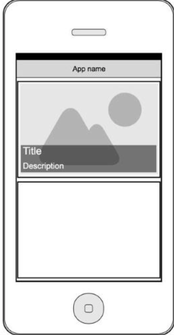

# React Native Test Task

Make an application for viewing news from https://newsapi.org using its API.

**General Requirements:**
* The application must be user friendly and display notifications and errors.
* Minimum supported operating systems are iOS 11 and Android 7.0.
* The project should be ready for installation and correctly displayed on both iOS and Android devices. 

**Requirements:**  
The application should contain TabBar menu with screens listed:
1. All Channels list screen:
The channel cell must contain the channel’s name and description;
The cell must have an option to add/remove  channels to Favorites.
2. Favorite Сhannels list screen:
This list must have an option to remove a channel from the it;
The right top corner must have a Show News button that displays a list of all the news from the favorite channels;
The news list must contain a search function. The search bar should appear at the top of the screen when the user swipes down;
The news cell should contain a picture of the news in the background, the news title and description. News description must be 2 lines max;
By pressing on the news cell user should be able to view details of news: picture, title, full description.
Add offline cache for news: after restarting the app, a user should be able to see previously downloaded news.

**The  UX example:**  

**General Notes:**  
* The source code of the application should be uploaded on github.com.
* Keep your code clean;
* Prefer quality to the speed of delivering the task;
* UI can be pretty simple but user friendly. Pay attention to interaction without glitches and undefined errors. 
